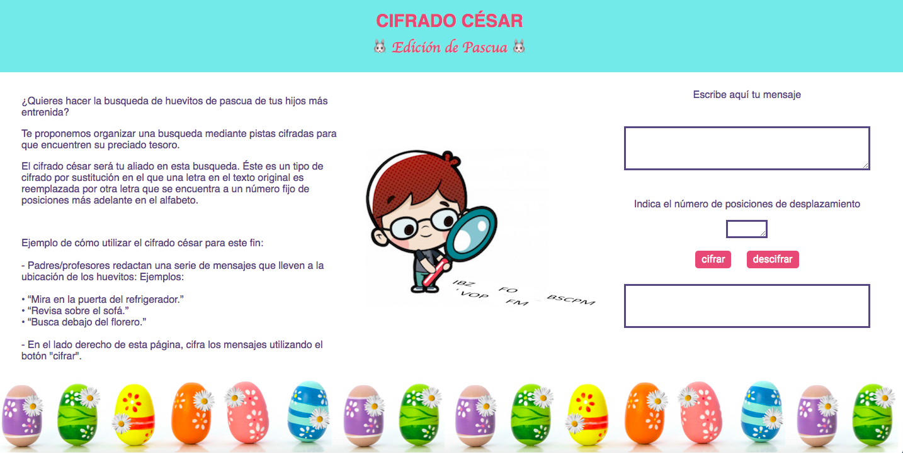

# Cifrado César: Edición de Pascua.

“Cifrado César, Edición de Pascua” es una aplicación web que cifra y descifra código césar. Éste es un tipo de cifrado por sustitución en el que una letra en el texto original es reemplazada por otra letra que se encuentra a un número fijo de posiciones más adelante en el alfabeto.

La aplicación está destinada a padres/profesores y sus hijos/alumnos, que quieran realizar una búsqueda de huevitos de pascua utilizando pistas cifradas. 

Ejemplo de cómo utilizar el cifrado cesar para este fin:

* Padres/profesores: redacten una serie de mensajes que lleven a la ubicación de los huevitos. 

  Ejemplos: 
  -	“Mira en la puerta del refrigerador”
  -	“Revisa sobre el sofá”
  -	“Busca debajo del florero”

* En la aplicación web, cifra los mensajes.

* Luego escríbe o impríme los mensajes cifrados. Indica en el mensaje el número de desplazamiento. 

* Colócalos en los lugares definidos para la búsqueda. También ubica los huevitos.

* Explicar a los niños como funciona el juego y el cifrado.

* ¡Inicien la búsqueda! Los niños pueden decodificar los mensajes en la aplicación.

Esta aplicación intenta hacer la experiencia de “Buscar Huevitos de Pascua” más entretenida y educativa para los niños. ¡Aprender del abecedario jugando!

## Decisiones de diseño

El diseño de la aplicación persigue 3 objetivos:

1)	Introducir al Usuario al cifrado césar.

2)	Presentar un ejemplo de cómo utilizar el cifrado cesar para organizar una búsqueda de huevos de pascua mediante pistas cifradas.

3)	Permitir el cifrado y descifrado de mensajes.

Para esto se diseñó una página de 3 columnas.

- En la primera columna se introduce al usuario y se presenta el ejemplo. Tiene scrolling de columna para leer hacia abajo.

- La segunda columna contiene la imagen de un niño con una lupa observando mensajes cifrados. 

- la tercera columna contiene los espacios para input y output de cifrado y descifrado.

La página se diseña de esta manera para presentar todo el contenido desde el ingreso a la página. Al encontrarse en columnas, permite que, si se ingresa más de una vez a la página, se acceda directamente al cifrado y descifrado.

La temática de la página (la Pascua) se manifiesta en el “footer” con huevitos de colores y en la elección de los colores en el “header”, color de fuente, áreas de ingreso y salida de texto; y botones. Para ello se seleccionó una paleta de colores “a tono” con los huevitos del “footer” (https://colorhunt.co/palette/119215).

## Qué hace el programa de cifrado y descifrado:

•	Cifra y descifra mayúsculas (a mayúsculas).

•	Cifra y descifra minúsculas (a minúsculas).

•	Cifra y descifra números (a números).

•	No se puede ingresar caracteres sobre 191 en ASCII (aparece alerta y no permite su ingreso).  Estos caracteres incluyen letras con acento y la Ñ.

•	Si se ingresa caracteres bajo o igual a ASCII 192, que no sean máyusculas, minúsculas o números, los caracteres se mantienen después del cifrado/descifrado. Esto incluye espacios y puntuaciones. También símbolos como ¡ % & ( ) [ ]?:

•	Sólo se puede ingresar números como offset. Si se ingresa algo que no sea número lanza una alerta. 

•	Si se ingresa un offset negativo para cifrar, el programa descifra.

•	Si se ingresa un offset negativo para descifrar, el programa cifra.